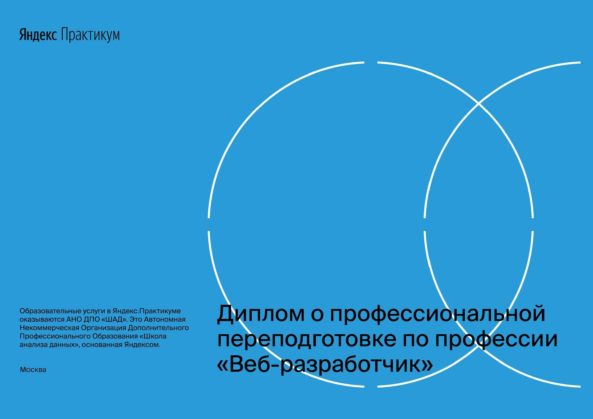
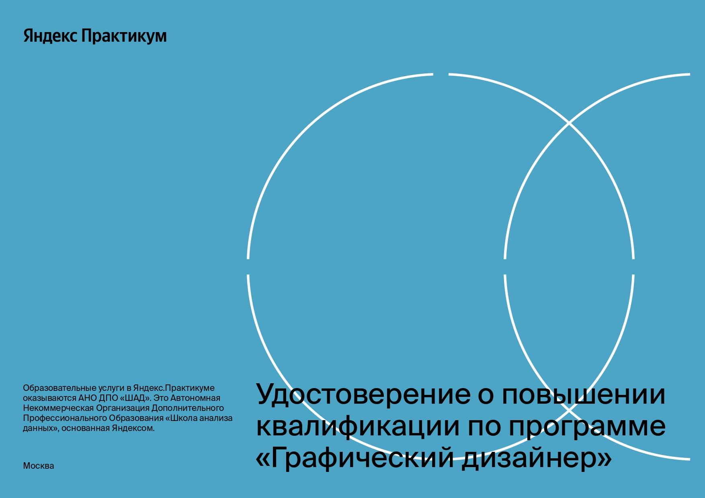
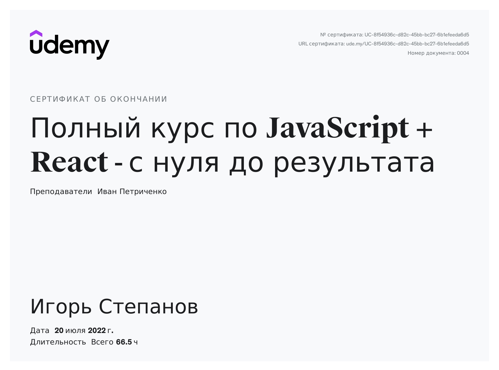
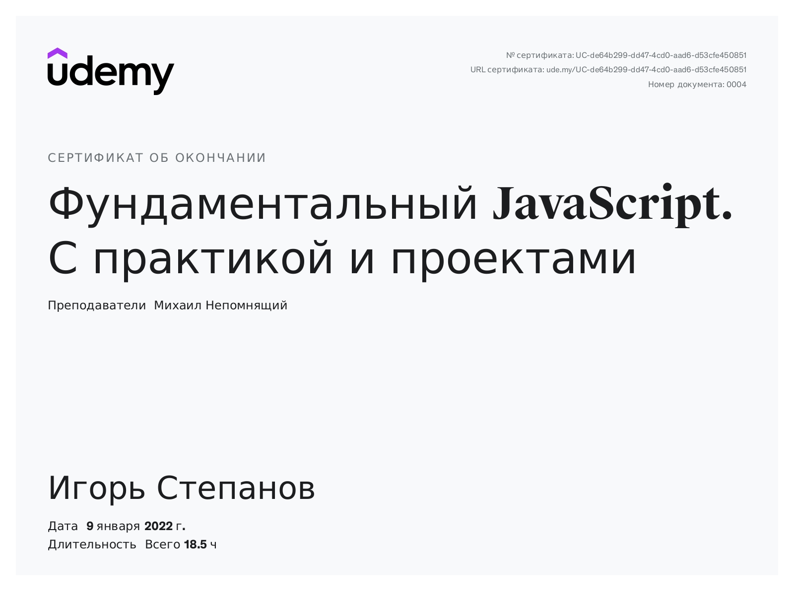
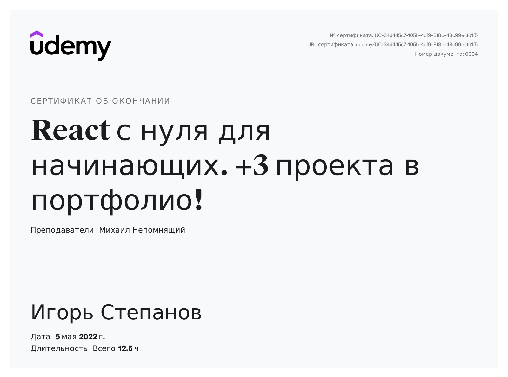
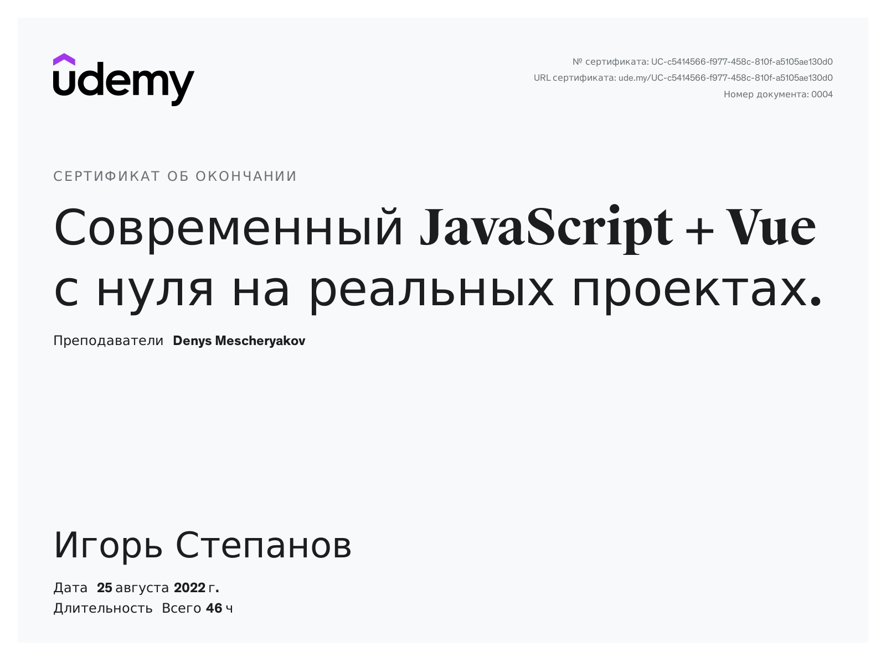
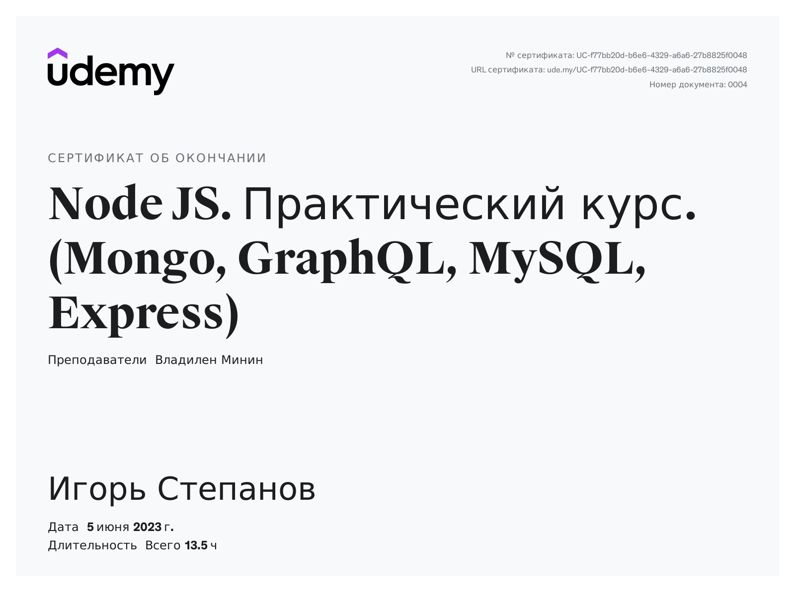
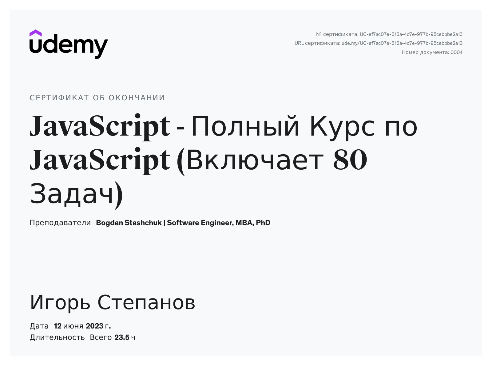
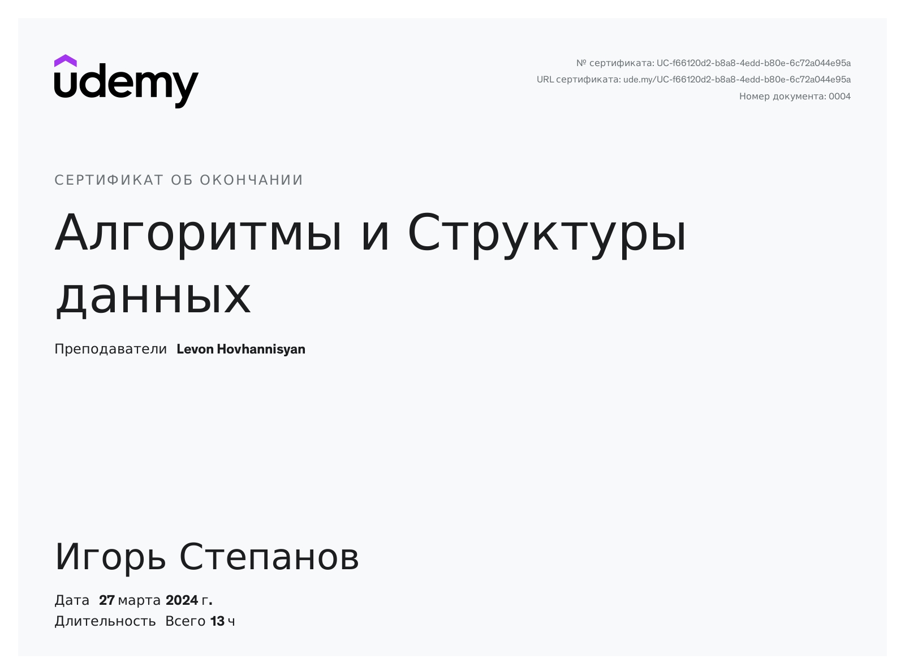

<h2 align="center">Меня зовут Игорь, я Frontend-разработчик </h2>

🎵 Включить музыку

<video src="https://user-images.githubusercontent.com/86494748/185793713-45eabbc9-c26f-4216-acc2-3f189d5eeee8.mov"><video>

### 👩‍💻 Обо мне:

Мне нравится решать сложные задачи: разрабатывать сайты и веб-приложения или создавать дизайн сайтов с удобным интерфейсом.

Меня захватывает процесс разработки и возможность создавать удобные и полезные продукты. Посмотрите мои работы в разделе Портфолио https://ia-stepanov.ru/.

Ещё защитил диплом [Веб-разработчика](https://practicum.yandex.ru/web/) в Яндекс Практикуме. Есть рекомендация от лида. Ежедневно практикуюсь в программировании, пишу pet-проекты, изучаю алгоритмы и фреймворки (React, Vue).

Открыт к предложениям на позицию frontend-разработчика. Если у вас есть вакансия, которая соответствует моим навыкам и опыту, не стесняйтесь связаться со мной — буду рад сотрудничеству 🙌

🎯 **Мои цели**:

- Научиться писать чистый код;
- Работать в дружной команде разработчиков;
- Работать над интересными проектами;
- Внести вклад в успех компании.

⚡ **Несколько фактов**:

- [Раскрашивал и анимировал х/ф «Берегись автомобиля»](https://www.behance.net/gallery/180535681/kolorizacija-hf-beregis-avtomobilja);
- Создавал проекты с дополнительной реальностью (AR);
- Разработал:
  - Новую технологию для автоматической вырезки на хромакее;
  - [Скрипт для автоматической отправки откликов на HeadHunter](https://github.com/ia-stepanov/autosend-letters-hh/);
  - [«Калькулятор фрилансера»](https://github.com/ia-stepanov/freelance-calculator/), приложение для формирования стоимости заказа.

📫 **Cвязаться со мной**:

, , , 

---

### 🛠 Языки и Технологии:

### 🎨 Графические редакторы:

---

### 👨‍🎓 Образование:

||||
|:----:|:----:|:----:|:----:|
||||
|||||

---

### 🔥 Моя статистика:

 

---

<!--  -->

